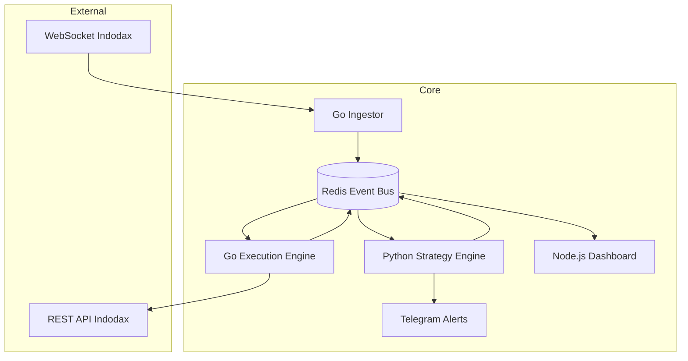

# 🧠 Bot Scalping - Event-Driven Trading System

A distributed, event-driven cryptocurrency trading system built with **Go, Python, Node.js, Redis, and Rust**.

Designed as a **mini quant infrastructure** for real-time trading, backtesting, and risk-managed execution on Indodax.

---

## 🚀 System Overview

This project is not a simple trading bot.

It is a:

> **Event-driven distributed trading system (mini quant infrastructure)**

All components communicate through a centralized **event bus (Redis)**.

---

## 🧠 Architecture



---

## ⚙️ Core Design Principles

### 🔷 1. Event-Driven Architecture
All communication flows through Redis events:

```
market.tick
signal.generated
order.executed
position.updated
```

---

### 🔷 2. Separation of Concerns

| Component | Responsibility |
|----------|----------------|
| Go Ingestor | Market data ingestion (low latency) |
| Python Strategy | Signal generation & indicators |
| Go Executor | Risk management & order execution |
| Redis | Event bus + state store |
| Node.js Dashboard | Real-time visualization |
| Telegram | Alerts & notifications |

---

### 🔷 3. Risk-First Design

Every trade passes through:

```
Signal → Risk Check → Position Sizing → Execution
```

---

### 🔷 4. Stateless Compute Layers

- Ingestor → Stateless
- Strategy → Stateless
- Executor → Semi-stateful
- Redis → Single source of truth

---

## 📁 Project Structure

```
bot-scalping/
│
├── config/                  # Strategy & risk configuration
|    ├── pairs.yaml
|    ├── settings.yaml
├── infra/                   # Redis & infrastructure config
|    ├── docker/
|    ├── monitoring/
|    ├── redis/
|    |    ├── redis.conf
├── libs/
|    ├── utils/
├── logs/
|    ├── dashboard/
|    ├── executor/
|    ├── ingestor/
|    ├── strategy/
├── rust/
|    ├── calc-core/
|    |    ├── src/
|    |    |    ├── lib.rs
|    |    ├── target/
|    |    |    ├── release/
|    |    |    ├── .rustc_info.json
|    |    ├── Cargo.lock
|    |    ├── Cargo.toml
├── services/
│    ├── dashboard-node/     # Real-time monitoring dashboard
|    |    ├── node_modules/
|    |    ├── public/
|    |    |    ├── index.html
|    |    ├── Dockerfile
|    |    ├── package-lock.json
|    |    ├── package.json
|    |    ├── server.js
│    ├── executor-go/        # Order execution & risk management
|    |    ├── cmd/
|    |    |    ├── main.go
|    |    ├── internal/
|    |    |    ├── execution/
|    |    |    ├── risk/
|    |    |    ├── state_machine/
|    |    ├── Dockerfile
|    |    ├── go.mod
|    |    ├── go.sum
│    ├── ingestor-go/        # Market data ingestion
|    |    ├── cmd/
|    |    |    ├── main.go
|    |    ├── internal/
|    |    |    ├── redis_client/
|    |    |    ├── validator/
|    |    |    ├── websocket/
|    |    |    |    ├── client.go
|    |    |    |    ├── message.go
|    |    |    |    ├── publisher.go
|    |    ├── Dockerfile
|    |    ├── go.mod
|    |    ├── go.sum
│    ├── strategy-python/    # Strategy engine (indicators & signals)
|    |    ├── bridge/
|    |    ├── engine/
|    |    |    ├── __pycache__
|    |    |    ├── __init__.py
|    |    |    ├── indicators.py
|    |    |    ├── orderbook.py
|    |    |    ├── signal_fusion.py
|    |    |    ├── state_manager.py
|    |    |    ├── telegram_notifier.py
|    |    ├── venv/
|    |    ├── Dockerfile
|    |    ├── main.py
|    |    ├── requirements.txt
├── shared/                   # Shared utilities
|    ├── events/
|    |    ├── event_types.yaml
|    ├── schemas/
|    |    ├── market_tick.json
|    |    ├── order.json
|    |    ├── orderbook.json
|    |    ├── position.json
|    |    ├── signal.json
├── state/                  # Persistent trading state
├── tests/                  # Backtest & paper trading
|    ├── backtest/
|    ├── integration/
|    ├── paper_trade/
|    ├── simulation/
├── .env
├── .gitignore
├── docker-compose.yml
├── init-project.sh
├── Makefile
```

---

## 🔄 Data Flow

```
Market Data
   ↓
Ingestor (Go)
   ↓
Redis Event Bus
   ↓
Strategy Engine (Python)
   ↓
Signal Event
   ↓
Execution Engine (Go)
   ↓
Exchange (Indodax)
   ↓
State Update
   ↓
Dashboard (Node.js)
```

---

## ⚙️ Tech Stack

### Backend
- Go (ingestion & execution)
- Python (strategy engine)
- Rust (optional acceleration layer)

### Infrastructure
- Redis (event bus & state)
- Docker (containerization)

### Frontend
- Node.js (WebSocket + REST API)
- React / Vue (dashboard UI)

---

## 📊 Features

- Real-time market data ingestion
- Technical indicators (RSI, MACD, VWAP)
- Order book imbalance analysis
- Risk management system
- Position sizing (Kelly-based)
- Circuit breaker protection
- Paper trading mode
- Backtesting framework
- Real-time dashboard
- Telegram alerts

---

## 🛡️ Risk Management

Built-in protections:

- Max daily drawdown limit
- Max loss per trade
- Consecutive loss cooldown
- Circuit breaker system
- Position size control

---

## 🧪 Development Phases

### Phase 1 — Foundation
- Repository setup
- Redis + Docker
- Ingestor service

### Phase 2 — Strategy Engine
- Indicators (RSI, MACD)
- Signal generation

### Phase 3 — Execution Layer
- Order execution
- Risk engine

### Phase 4 — Monitoring
- Dashboard
- Logging system

### Phase 5 — Testing
- Backtesting
- Paper trading

### Phase 6 — Live Trading
- Small capital deployment
- Gradual scaling

---

## ⚠️ Disclaimer

This project is for **educational and research purposes**.

Cryptocurrency trading involves high risk. Use at your own responsibility.

---

## 🧠 Key Insight

The strength of this system is not complexity, but:

- Event-driven design
- Strict risk control
- Clean separation of services
- State consistency via Redis

---

## 🚀 Status

> Architecture finalized — implementation phase ready

---
